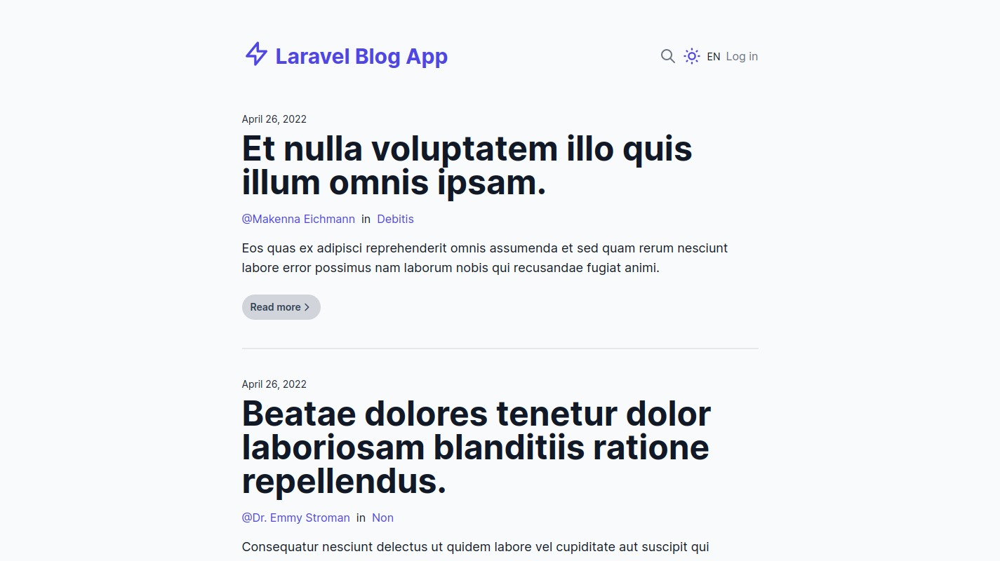
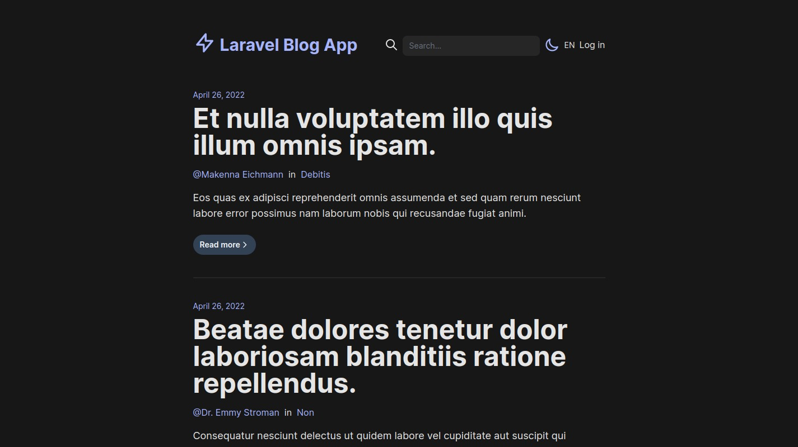
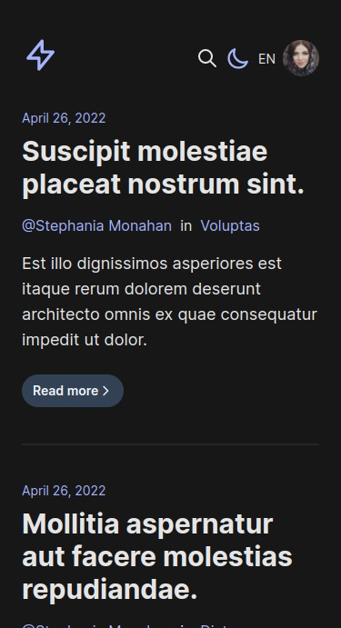
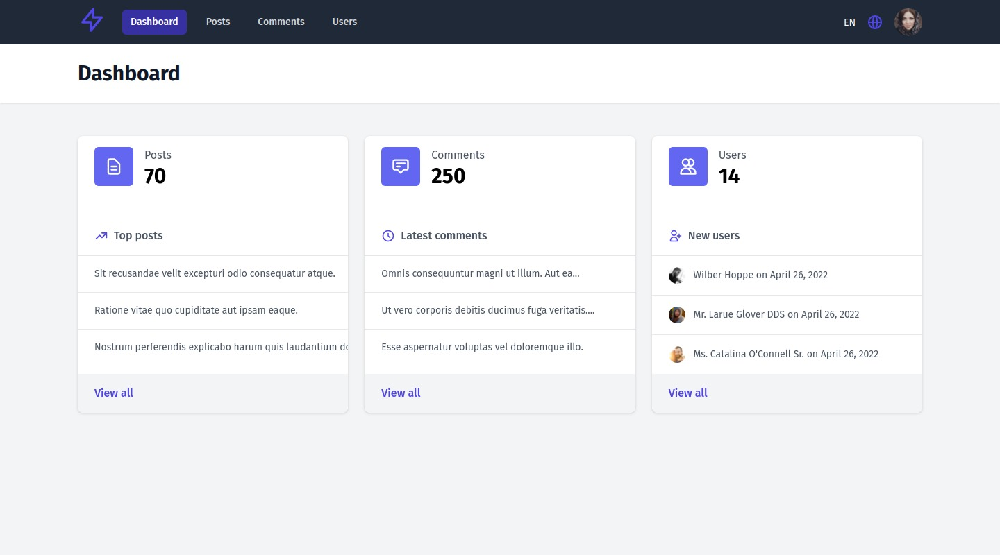
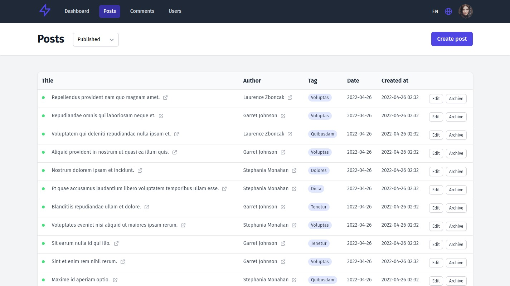
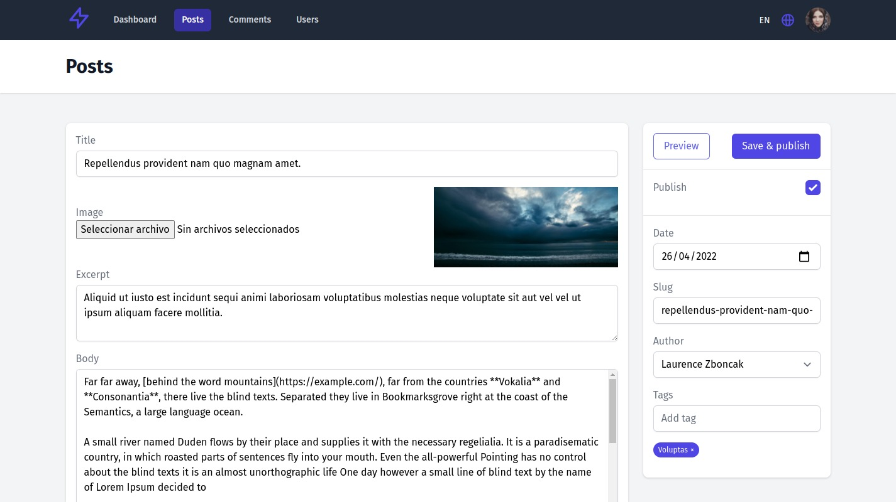
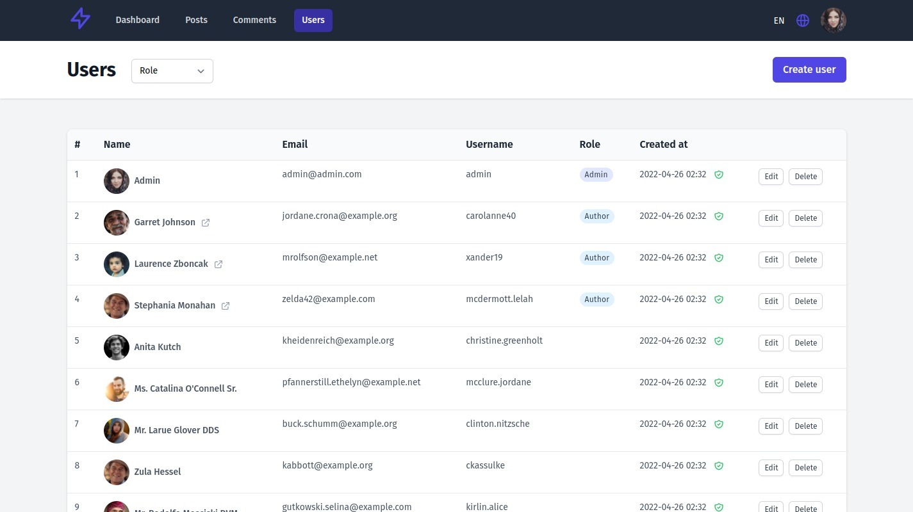
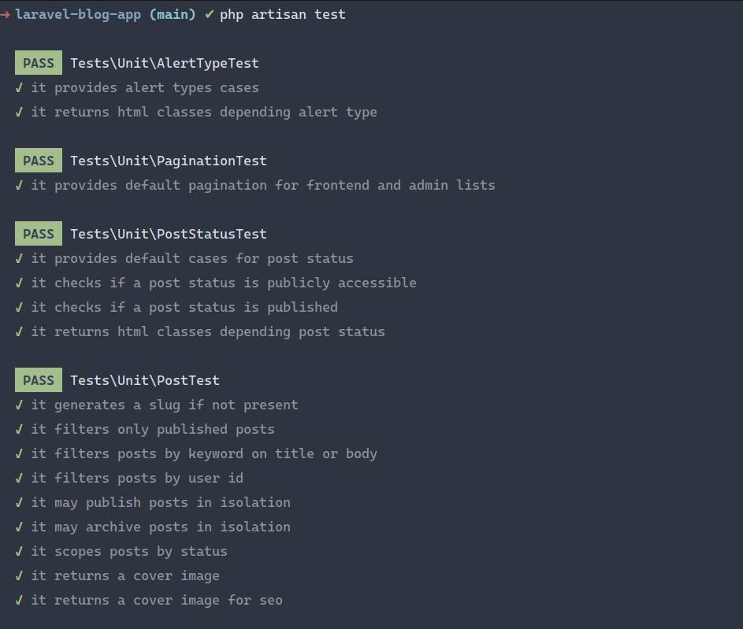

[](https://laravel.com)
[](https://conventionalcommits.org)
[](http://commitizen.github.io/cz-cli/)
[](/LICENSE.md)
[](https://github.com/fedesoriadev/laravel-blog-app/actions/workflows/build.yml)

# Laravel Blog App

> A simple blog editing system made with Laravel + Tailwind CSS and Alpine.js

## Why

The goal of this project is to build a blogging system from scratch using new Laravel features and the 
bare minimum of libraries.

Also, as a good opportunity to develop all the core functionalities with Test Driven Development (TDD) and for check out 
GitHub Actions and SemVer release flow.

## Libraries

+ [Laravel](https://laravel.com/) - *A PHP web application framework with expressive, elegant syntax.*
+ [Laravel Fortify](https://laravel.com/docs/fortify/) - *Frontend agnostic authentication backend implementation for Laravel.*
+ [Tailwind CSS](https://tailwindcss.com/) - *A utility-first CSS framework.*
+ [Alpine.js](https://alpinejs.dev/) - *Lightweight, JavaScript framework.*
+ [Laravel Flash](https://github.com/spatie/laravel-flash/) - *A lightweight package to flash messages.*
+ [Laravel Translation](https://github.com/vemcogroup/laravel-translation/) - *Translation package for Laravel to scan for localisations.*

## Features

- [x] Posts, authors, tags and comments
- [x] Authentication and authorization
- [x] Profile management
- [x] Admin CRUD
- [x] Users and roles
- [x] Responsive design
- [x] Translation (en / es)
- [x] Dark mode

## Requirements

+ [PHP >= 8.1](https://www.php.net/)
+ Database (eg: MySQL, PostgreSQL, SQLite)
+ [Composer](https://getcomposer.org/)
+ [npm](https://docs.npmjs.com/downloading-and-installing-node-js-and-npm) or [yarn](https://yarnpkg.com/)

You can get these requirements installed manually or by using [Laravel Sail](https://laravel.com/docs/sail)
> Laravel Sail is a light-weight command-line interface for interacting with Laravel's default Docker configuration. 
> Sail provides a great starting point for building a Laravel application using PHP, MySQL, and Redis 
> without requiring prior Docker experience.

## Instalation

#### TL;DR

```bash
git clone https://github.com/fedesoriadev/laravel-blog-app.git && cd laravel-blog-app
composer install
cp .env.example .env
php artisan key:generate
php artisan migrate --seed
npm install && npm run dev 
php artisan serve
```

#### Steps

1. Clone the repository and cd into
```bash
git clone https://github.com/fedesoriadev/laravel-blog-app.git && cd laravel-blog-app
```
2. Install dependencies using composer
```bash
composer install
```
3. Copy the example env file and make the required configuration changes in the .env file
```bash
cp .env.example .env
```
4. Generate a new application key
```bash
php artisan key:generate
```
5. Run the database migrations and seed with dummy data
```bash
php artisan migrate --seed
```
6. Install node dependencies and generate front-end assets
```bash
npm install && npm run dev
```
7. Start the local development server
```bash
php artisan serve
```

## Testing

```bash
./vendor/bin/phpunit
```
or
```bash
php artisan test
```

## TODO

- [ ] RSS feed
- [ ] Markdown editor
- [ ] Newsletter subscription
- [ ] Admin sortable tables

## Screenshots


---



---



---



---



---



---



---


